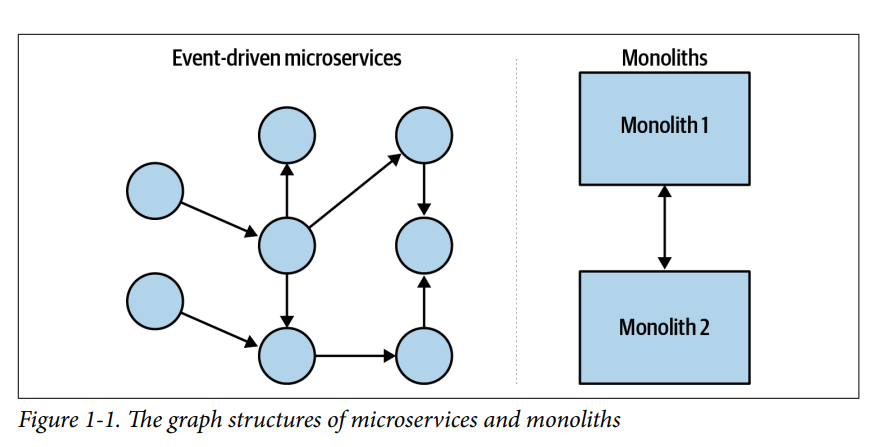

# Building Event-Driven Microservices - Adam Bellemare
## Why Event-Driven Microservices?

You need only look at the his‐
tory of computing inventions to see how network communications, relational data‐bases, big-data developments, and cloud computing have significantly altered how
architectures are built and how work is performed. Each of these inventions changed not only the way that technology was used within various software projects, but also
the way that organizations, teams, and people communicated with one another. From
centralized mainframes to distributed mobile applications, each new medium has
fundamentally changed people’s relationship with computing.

## What Are Event-Driven Microservices?
Microservices and microservice-style architectures have existed for many years, in
many different forms, under many different names. Service-oriented architectures
(SOAs) are often composed of multiple microservices synchronously communicating
directly with one another. Message-passing architectures use consumable events to
asynchronously communicate with one another. Event-based communication is certainly not new, but the need for handling big data sets, at scale and in real time, is new
and necessitates a change from the old architectural styles.

 
In a modern event-driven microservices architecture, systems communicate by issuing and consuming events. These events are not destroyed upon consumption as inmessage-passing systems, but instead remain readily available for other consumers to
read as they require.
 

**A typical definition of “small” is something
that takes no more than two weeks to write. By another definition, the service should be able to (conceptually) fit within one’s own head.**
 
These services consume events from input event streams; apply their specific business logic; and may emit their own output events, provide data for request-response access, communicate with a third-party API, or perform other required actions. 
 
This combination of event streams and microservices forms an interconnected graph
of activity across a business organization. Traditional computer architectures, com‐
posed of monoliths and intermonolith communications, have a similar graph struc‐
ture. Both of these graphs are shown in Figure 1-1.

## What's Bounded Context?
The logical boundaries, including the inputs, outputs, events, requirements, processes, and data models, relevant to the subdomain. While ideally a bounded context and a subdomain will be in complete alignment, legacy systems, technical debt, and third-party integrations often create exceptions. Bounded contexts are also a property of the solution space and have a significant impact on how micro‐services interact with one another.
 
Connections between bounded contexts should be loosely coupled, as changes made within one bounded context should minimize or eliminate the impact on neighboring contexts. A loose coupling can ensure that requirement changes in one context do not propagate a surge of dependent changes to neighboring contexts.

## Leveraging Domain Models and Bounded Contexts

Every organization forms a single domain between itself and the outside world.
Everyone working within the organization is operating to support the needs of its
domain.
 
This domain is broken down into subdomains—perhaps, for a technology-centric company, an Engineering department, a Sales department, and a Customer Support department. Each subdomain has its own requirements and duties and may itself be subdivided. This division process repeats until the subdomain models are granular and **actionable and can be translated into small and independent services by the implementing teams.** 
Bounded contexts are established around these subdomains
and form the basis for the creation of microservices.
 

## Aligning Bounded Contexts with Business Requirements

Aligning bounded contexts on business requirements allows teams to make changes
to microservice implementations in a loosely coupled and highly cohesive way. It pro‐
vides a team with the autonomy to design and implement a solution for the specific
business needs, which greatly reduces interteam dependencies and enables each team
to focus strictly on its own requirements.
 
Conversely, aligning microservices on technical requirements is problematic. This
pattern is often seen in improperly designed synchronous point-to-point microservi‐
ces and in traditional monolith-style computing systems where teams own specific
technical layers of the application. The main issue with technological alignment is
that it distributes the responsibility of fulfilling the business function across multiple
bounded contexts, which may involve multiple teams with differing schedules and
duties. Because no team is solely responsible for implementing a solution, each ser‐
vice becomes coupled to another across both team and API boundaries, making
changes difficult and expensive.
