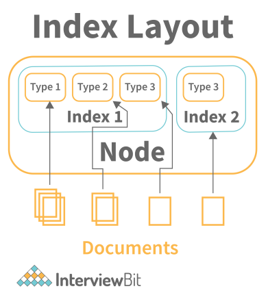

# Elastic Search
Elasticsearch is a modern, distributed, and analytics search engine that is based or built on Apache Lucene. ElasticSearch enables you to store, search, and analyze vast or huge amounts of data in near real-time, providing results in milliseconds.
 

As opposed to most NoSQL databases, Elasticsearch NoSQL focuses more on search capabilities and provides a rich HTTP RESTful API that allows for fast searches in near real-time.

# Advantages of ElasticSearch
- **Elasticsearch is a fast search engine**  
Elasticsearch a good choice for time-sensitive use cases such as infrastructure monitoring and security analytics.

- **Elasticsearch is a distributed search engine **
Elasticsearch stores or distributes documents across several containers called shards, which are duplicated to provide redundant copies of the data in the event of a hardware or system failure. 
 Due to Elasticsearch's distributed nature, it can scale up to thousands of servers and can handle petabytes of data.

- **Data ingestion, visualization, and reporting are simplified** 
Data can be collected and processed easily using Beats and
Logstash before being indexed in Elasticsearch.Kibana provides UIs for quick access to log files, application performance monitoring (APM), and infrastructure metrics data.'

# ElasticSearch Usecases
Elasticsearch's speed and scalability as well as its ability to index different types of data make it ideal for a number of use cases. In addition to its high scalability, Elasticsearch also offers near-real-time search capabilities. 

it is typically the underlying technology for applications requiring complex search
requirements.

# How does Elastic Search work?
- Gathering raw data from log files, system metrics or web apps.
- Normalizing and analyzing raw data.
- Send normalizied raw data to be indexed in Elastic search.
- Users can run queries.
- From Kibana,  users can create powerful visualizations of data, and visualize complex queries through interactive diagrams

# Different Data Types in Elastic Search
- Common data types
    - Binary
    - Boolean
    - Keywords: The keyword family, which includes the keyword, constant keyword ,and wildcard.
    - Numbers
    - Dates
    - Alias: Represents the alias of an existing field.

- Objects and relational types
    - Object: Represent a JSON object.
    - Nested: A JSON object that maintains a relationship between its subfields.
    - Flattened: An entire JSON object represented by a single field value.
    - Join: Establishes a parent/child relationship between documents within an index.

- Structured and Spatial data types
    - Range: Range types, like date_range, long_range float_range, double_range, and IP_range.
    - Point: Arbitrary cartesian points.
    - Geo_point: Longitude and latitude points
    - Shape: Arbitrary cartesian geometries.
    - Geo_shape: Complex shapes like polygons.

# Stoping Elastic Search on Ubuntu
You will need to 'kill' the running process. It is accomplished by sending a SIGTERM request to the process, which ends or terminates it. In order to initiate the shutdown process, you must first determine the process identifier (PID) for the Elasticsearch service you wish to terminate. Grep command can be used to locate processes easily.

# Elastic Search Mapping
ElasticSearch mappings define how documents and their fields are indexed and stored in ElasticSearch databases or ElasticSearch DBs.This defines the types and formats of the fields that appear in the documents. It refers to indexing.
 

### Types of mapping
- **Static mapping:** Users perform static mappings when they create an index. We use static mappings to define data types and indexes.

- **Dynamic mapping:** Elasticsearch automatically creates dynamic mappings for the tables. The dynamic mapping of Elasticsearch comes in handy when we need to store extra attributes on documents. It is not always necessary to configure field names and types when indexing documents, as these will be created automatically by Elasticsearch based on any predefined rules.

# Elastic Search Fuzzy Search
With fuzzy search, you can find documents with terms similar to your search term based on a Levenshtein edit distance measure.
- Change one character (box → fox)
- Remove one character (black → lack)
- Insert one character (sic → sick)
- Transpose two adjacent characters (act → cat)

Within a specific edit distance, the fuzzy query generates a list of all possible variations and expansions of the search term. After that, the query returns a list of all possible matches. The most relevant and exact matches appear near the top of the list.

# Clusters in Elastic Search
A cluster is a collection of connected nodes. If you run only one instance or node of Elasticsearch, then you have a single-node cluster or a cluster of one node. 

Clusters automatically reorganize themselves when nodes join or leave so the data is distributed evenly among all the nodes. Despite being fully functional, the cluster is at risk of data loss if it fails.

# Node in Elastic Search
You can think of a node as a single server that forms part of your cluster. Nodes are assigned roles that describe their responsibilities and operations. By default, every cluster node can handle HTTP and transport traffic.  

Communication between nodes is carried out via the transport layer, while REST clients utilize the HTTP layer. Nodes in a cluster are aware of each other and can forward client requests to the right node.

# Document in Elastic Search
The term "document" refers to a **unit of information that can be indexed.** Each index within Elasticsearch contains multiple documents. 
 

For instance, you could have a document for every customer, another for every order, etc. These documents are written in JSON, which is a widely used format for internet data exchange. Documents are composed of fields, and each field has its own type of data. In a particular index, you can store as many documents as you wish.

# Operations perform on a document
- Indexing a document
- Fetching documents
- Updating documents
- Deleting documents

# Index in Elastic Search
An index is a collection of documents that are somewhat similar in nature.
 
As an example, you could have an index of customer data, another one of product catalogs, and another one of order data.  The name of an index (which must be all lowercase) serves as an identifier for the index when indexing, searching, updating, and deleting documents contained within it. 
*An index (plural: indices) can have one or more than one shards and replicas.*

# Shards and Replica in Elastic Search
- Shard 
Elasticsearch crashes are often caused by large indexes.
Due to the unlimited number of documents that can be stored on each index, an index may consume more disk space than the hosting server can provide. Indexing will begin to fail as
soon as the index reaches this limit.
 
As a solution to this problem, it is possible to divide or segment indexes horizontally into multiple pieces, also called shards. For an index, you can easily specify how many shards you want.

