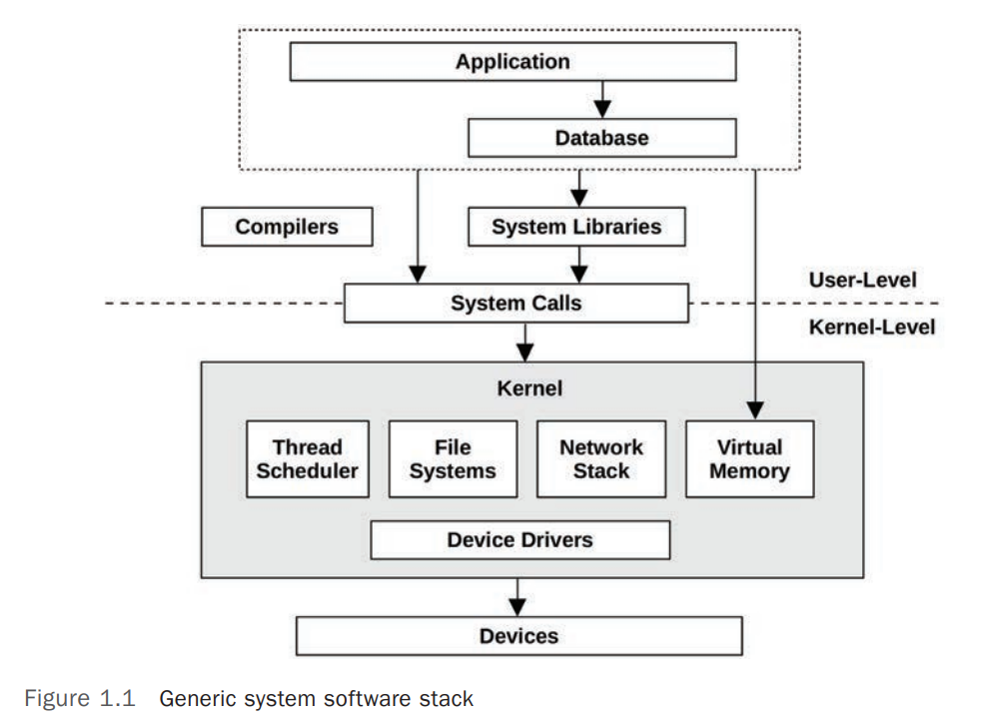

# Systems Performance - Second Edition - Brendan Gregg

## Systems Performance
Systems performance studies the performance of an entire computer system, including all major 
software and hardware components.
 
Anything in the data path, from storage devices to application software, is included, because it can affect performance. 
 
If you don’t have a diagram of your environment showing the 
data path, find one or draw it yourself; this will help you understand the relationships between 
components and ensure that you don’t overlook entire areas.
 
The typical goals of systems performance are to improve the end-user experience by reducing 
latency and to reduce computing cost. Reducing cost can be achieved by eliminating inefficiencies, improving system throughput, and general tuning.
 

Figure 1.1 shows a generic system software stack on a single server, including the operating 
system (OS) kernel, with example database and application tiers. The term full stack is sometimes 
used to describe only the application environment, including databases, applications, and web 
servers. When speaking of systems performance, however, we use full stack to mean the entire 
software stack from the application down to metal (the hardware), including system libraries, 
the kernel, and the hardware itself. Systems performance studies the full stack.

 

Systems performance involves a variety of activities. The following is a list of activities that are 
also ideal steps in the life cycle of a software project from conception through development to 
production deployment.

- Setting performance objectives and performance modeling for a future product.

- Setting performance objectives and performance modeling for a future product.

- Performance analysis of in-development products in a test environment.

- Non-regression testing for new product versions.

- Benchmarking product releases.

- Proof-of-concept testing in the target production environment.

- Performance tuning in production

- Monitoring of running production software.

- Performance analysis of production issues.

- Incident reviews for production issues.

- Performance tool development to enhance production analysis.
